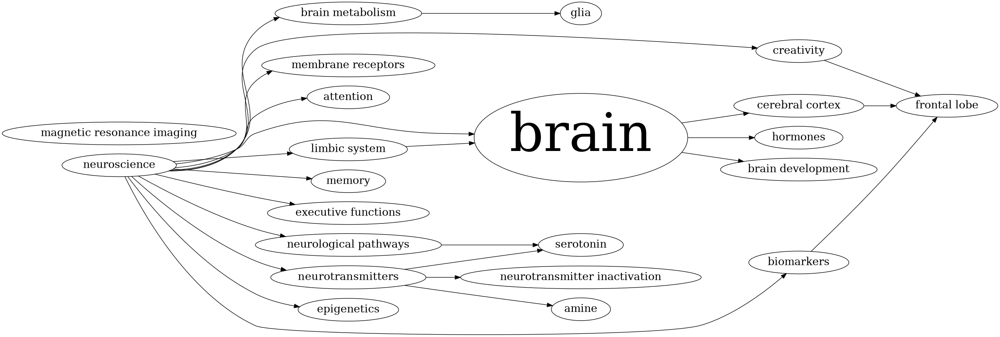
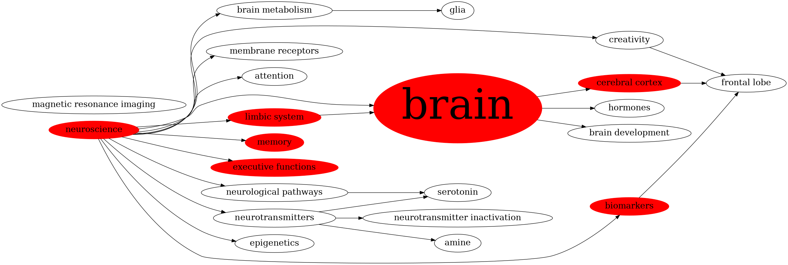
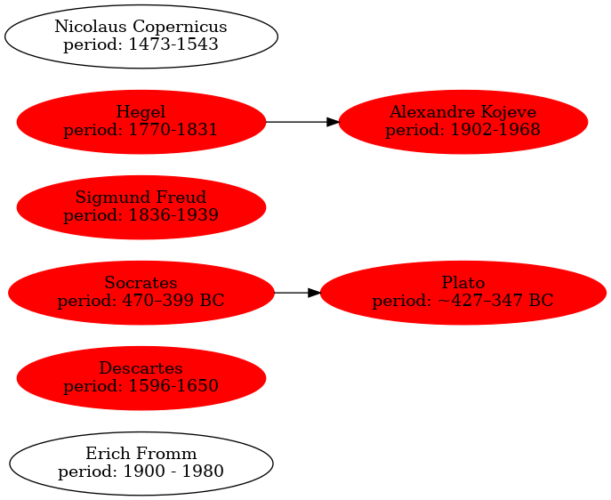

- [Intro](#introduction)
- [Usage](#usage-guide)
- [Commands](#commands)
- [Screenshots](#screenshots)
- [Installation](#installation)
- [Options](#options)

# Introduction
VimWikiGraph is a plugin extension for [vimwiki](https://github.com/vimwiki/vimwiki). 
It creates a directed graphs of links between vimwiki files and allows for various
filtering operations.

# Usage Guide
VimWikiGraph currently supports one filtering method and two text extraction/highlighting methods.
Notes can be filtered according to their tags. Tags may only occur in the first line of every note
and are separated by colons `:tag1:tag2:tag3:`. Additionally, nodes can be highlighted and their
labels extended by specifying regexes [see the examples below](#screenshots).

# Commands
The internal graph representation is automatically generated upon plugin load. If, upon creating 
new links or files you want to refresh the graph, you can call `VimWikiBuildGraph`.

The graph is visualized by calls to either
`VimWikiGenerateGraph [tags]` or `VimWikiGenerateGraphC <regex> <regex> [tags]` where the former 
is a more streamlined version that only supports tag filtering. Note that multiple tags are supported
and all arguments should be separated only by spaces. Quoting is not required but spaces should be
escaped if used within a regex. 

Calling `VimWikiGenerateGraphC v:none v:none` is equivalent to calling `VimWikiGenerateGraph`. 

# Screenshots
Visualize a graph of all notes tagged with 'neuroscience': 
`VimWikiGenerateGraph neuroscience`


Additionally highlight all notes containing the word 'memory' (capitalized or not): 
`VimWikiGenerateGraphC (M|m)emory v:none neuroscience`


Display all notes tagged with person while extracting information matching `period:.*`
and highlighting notes that contain `philoso`: 
`VimWikiGenerateGraph (P|p)hiloso period:.* person`


# Installation
Installation with [vim-plug](https://github.com/junegunn/vim-plug) is straightforward. 
Simply paste the following snippet in your rc, call `PlugInstall` and you're good to go.
```
Plug 'https://github.com/lambdasonly/VimwikiGraph', { 'for': 'vimwiki', 'do': './install.sh' }
```

# Options
Required options:
```
let g:vimwiki_root_dir = '/Path/To/VimWiki'
```

Default options:
```
let g:vimwiki_collapse_nodes = ['diary/diary.wiki']
let g:vimwiki_weight_attribute = 1
let g:vimwiki_graph_name = '/tmp/vimwikigraph'
let g:vimwiki_highlight_attributes = ['style', 'color']
let g:vimwiki_highlight_values = ['filled', 'red']
```
- `vimwiki_collapse_nodes` accepts a list of relative paths to vimwiki notes. 
  All direct descendants are collapsed i.e. all links to or from descendants 
  are replaced with links to or from the parent.
- `vimwiki_weight_attribute` if not set to 0, node sizes are weighted by their inbetweenness centrality
- `vimwiki_highlight_attributes` node attributes to set if the highlight regex matches
- `vimwiki_highlight_values` node values to set if the highlight regex matches. Must have the same dimension
  as `vimwiki_highlight_attributes`
