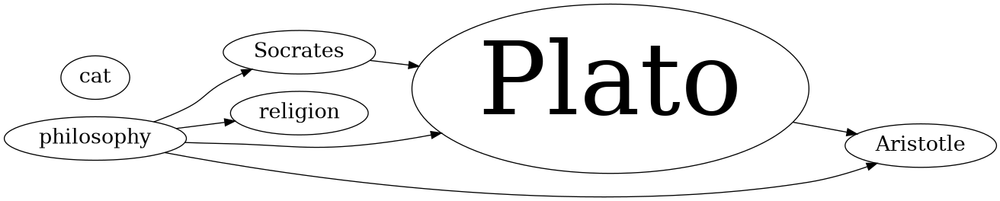
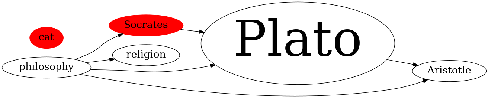
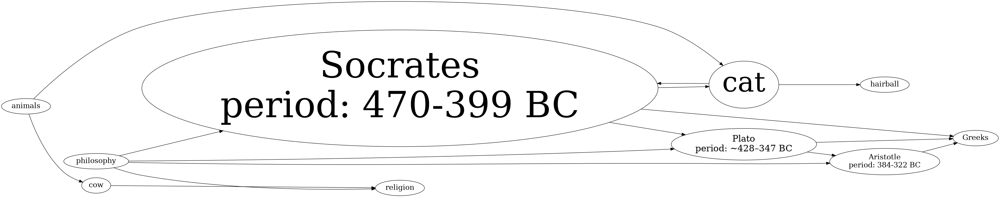

- [Intro](#introduction)
- [Usage](#usage-guide)
- [Commands](#commands)
- [Screenshots](#screenshots)
- [Installation](#installation)
- [Options](#options)

# Introduction
VimWikiGraph is a plugin extension for [vimwiki](https://github.com/vimwiki/vimwiki). 
It creates a directed graphs of links between vimwiki files and allows for various
filtering operations. For the motivation and a practical usecase of this plugin see
my related [blog post](https://padawansperegrinations.com/2022/06/25/was-socrates-a-cat/).

# Usage Guide
VimWikiGraph currently supports one filtering method and two text extraction/highlighting methods.
Highlighting and filtering is performed via regular expressions. [See the examples below](#screenshots).

# Commands
The graph is visualized by calls to either `VimWikiGenerateAdjacencyGraph <depth>`,
`VimWikiGenerateGraph [regexes]`, `VimWikiGenerateGraphC <highlight_regex> [regexes]`
or `VimWikiGenerateGraphCC <extraction_regex> <highlight_regex> [regexes]`.
The adjacency graph contains all nodes that are at most `depth` hops away from the current node (the
currently active buffer). `VimWikiGenerateGraph [regexes]` is a more streamlined version that only supports
filtering. It is equivalent to `VimWikiGenerateGraphC v:none [regexes]` and
`VimWikiGenerateGraphCC v:none v:none [regexes]`. Note that multiple filter regexes are
supported and all arguments should be separated only by spaces. Quoting is not required but spaces should be
escaped if used within a regex. 

# Screenshots
Visualize a graph of all notes containing the word 'philo': 
`VimWikiGenerateGraph philo`


Additionally highlight all notes containing the word 'cat': 
`VimWikiGenerateGraphC cat philo`


Display the full graph with the newly found connections while extracting information matching `period:.*`: 
`VimWikiGenerateGraphCC v:none period:.*`


# Installation
Installation with [vim-plug](https://github.com/junegunn/vim-plug) is straightforward. 
Simply paste the following snippet in your rc, call `PlugInstall` and you're good to go.
```
Plug 'https://github.com/lambdasonly/VimwikiGraph', { 'for': 'vimwiki', 'do': './install.sh' }
```

# Options
Required options:
```
let g:vimwiki_root_dir = '/Path/To/VimWiki'
```

Recommended keybindings:
```
noremap <Leader>wga :VimWikiGenerateAdjacencyGraph 2<CR>
noremap <Leader>wgg :VimWikiGenerateGraph
```

Default options:
```
let g:vimwiki_collapse_nodes = ['diary/diary.wiki']
let g:vimwiki_weight_attribute = 1
let g:vimwiki_graph_name = '/tmp/vimwikigraph'
let g:vimwiki_highlight_attributes = ['style', 'color']
let g:vimwiki_highlight_values = ['filled', 'red']
```
- `vimwiki_collapse_nodes` accepts a list of relative paths to vimwiki notes. 
  All direct descendants are collapsed i.e. all links to or from descendants 
  are replaced with links to or from the parent.
- `vimwiki_weight_attribute` if not set to 0, node sizes are weighted by their inbetweenness centrality
- `vimwiki_highlight_attributes` node attributes to set if the highlight regex matches
- `vimwiki_highlight_values` node values to set if the highlight regex matches. Must have the same dimension
  as `vimwiki_highlight_attributes`
