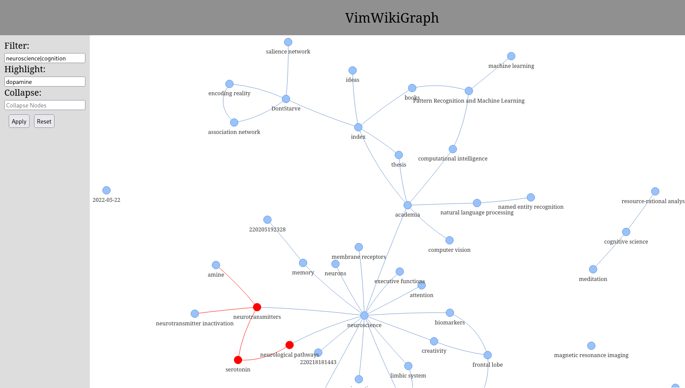

# Introduction
VimWikiGraph is a flask web application for visualising [VimWiki](https://github.com/vimwiki/vimwiki). 
It creates an undirected graphs of links between VimWiki files that affords filtering and highlighting.
Highlighting and filtering are performed via regular expressions so multiple keywords can be combined with
the pipe operator `expr1|expr2`. 



# Installation
Clone the repository, run `pip install -e .` and copy `vimwikigraph.sh` to a directory included in your PATH.


# Configuration
The path to the wiki must be specified in a config file indicated by an environment variable. A template
config file is provided.
```
export VIMWIKIGRAPH_CONFIG=~/path/to/vimwikigraph.cfg
```
